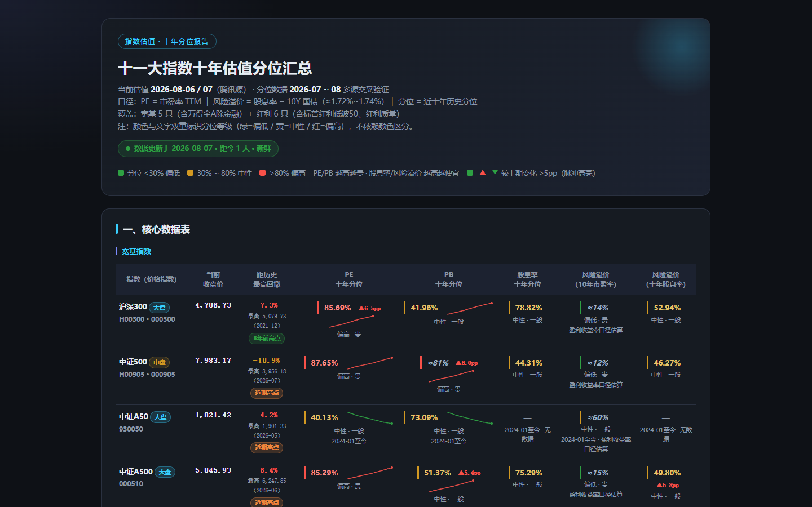
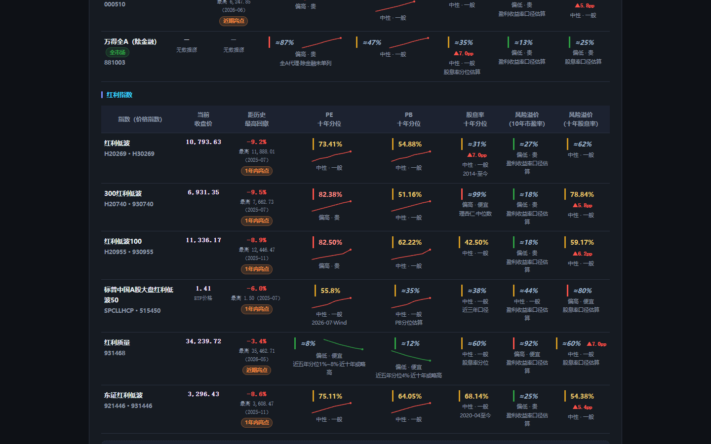
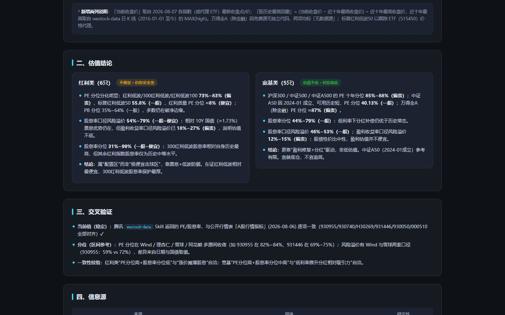
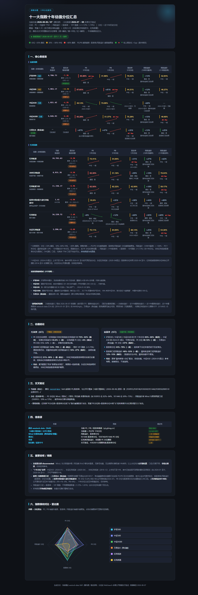

# A股十一大指数 · 十年估值分位汇总

> 一份单页 HTML 报告 + 配套数据说明，汇总 **11 只 A 股核心指数**（宽基 5 只 + 红利 6 只）的十年估值分位，并以「贵 / 一般 / 便宜」统一标注，便于一眼判断当前估值水位。

🌐 **在线预览（部署版）**：[https://a-share-index-valuation-report.vercel.app/](https://a-share-index-valuation-report.vercel.app/)

## 网站预览

> 以下为部署版页面的**真实截图**，自上而下展示：① 首页顶部 → ② 估值分位表格 → ③ 底部指数横向对比雷达图 → ④ 完整页面一览。

**① 首页 / 顶部**

**② 估值分位表格（向下滚动）**

**③ 底部：指数横向对比雷达图**

**④ 完整页面一览**

## 指数清单

**宽基指数（5 只）**

| 指数 | 市值层级 | 编制说明 |
|---|---|---|
| 沪深300 | 大盘 | 沪深两市市值大、流动性最好的前 300 只龙头，覆盖约 A 股 60% 总市值 |
| 中证500 | 中盘 | 剔除沪深300后，按总市值排名 301–800 的中盘股（平均市值约 200–330 亿） |
| 中证A50 | 大盘 | 各一级行业市值最大的 50 只龙头（"核心资产"），2024-01-02 发布 |
| 中证A500 | 大盘（宽基） | 跨行业大盘宽基，约 77% 权重来自沪深300、18% 来自中证500，市值中位约 500 亿 |
| 万得全A（除金融） | 全市场 | 覆盖全部 A 股、剔除金融板块（银行/券商/保险等）后的全市场表征指数 |

**红利指数（6 只，按表内自上而下顺序）**

| 顺序 | 指数 |
|---|---|
| 1 | 红利低波 |
| 2 | 300红利低波 |
| 3 | 红利低波100 |
| 4 | 标普中国A股大盘红利低波50 |
| 5 | 红利质量 |
| 6 | 东证红利低波 |

## 估值维度与贵贱规则

五个分位列统一按阈值着色：
- `<30%` 偏低（绿） · `30%~80%` 中性（琥珀） · `>80%` 偏高（红）

贵贱判定（与"PE/PB 越高越贵、股息率/风险溢价 越高越便宜"一致）：
- **PE / PB 分位**：越高 → 越贵
- **股息率 / 风险溢价 分位**：越高 → 越便宜（越值得买）

## 数据来源与口径

- **当前值（稳定）**：腾讯 `westock-data` Skill（`qt.gtimg.cn`），与公开行情表「A股行情指标」(2026-08-06) 逐项对齐。
- **分位（区间参考）**：Wind / 理杏仁 / 雪球 / 同花顺 经媒体披露的公开数据，多源交叉验证；口径、日期不同，**非稳定通道**，仅供区间参考。
- 风险溢价（10年市盈率）≈ `100% − PE十年分位`（盈利收益率 `1/PE − 10Y国债` 的十年分位，国债扰动小，按 PE 分位反推估算）。
- 风险溢价（十年股息率）= `股息率 − 10Y国债（≈1.73%）` 的十年分位。

## 重要局限

- 付费连接器（Wind / 东方财富妙想 / 同花顺 iFinD）全部 disconnected 且无账号，无法获取权威十年序列。
- "十年分位"边界：中证A50（2024-01）、东证红利低波（2020-04）、300红利低波（2018-12）等上市不足十年，已按可获取的最长区间标注。
- 万得全A（除金融）免费源仅披露"万得全A"，以全A代理；标普红利低波50 部分分位为估算 / 近三年口径；红利质量(931468) 仅获近五年分位，十年分位以近五年极值近似。
- 数据**不构成投资建议**，估值分位随行情每日变动。

## 数据与展示分离（JSON 驱动）

报告采用**数据与展示分离**架构：估值数据全部抽离到 `data.json`，页面加载时由 JavaScript 读取并渲染表格。**更新数据只需替换 `data.json`，报告页面不动**，零改错风险。

## 增量更新标记（变化高亮）

每个分位字段带「较上期分位」对比：当两期差值 **> 5pp** 时，该单元格显示 `▲/▼ N.Npp` 徽标（▲红=分位上升=更贵，▼绿=分位下降=更便宜，沿用 A 股涨红跌绿约定），并触发一次**脉冲高亮动画**，一眼识别"哪些指数估值发生了显著变化"；差值 ≤ 5pp 则不标记（视为无显著变化）。

## 数据时效自动检测

页面顶部自动渲染**时效指示器**，按数据日期距今天数分级：
- **< 7 天**：绿色「新鲜」
- **7–30 天**：黄色「注意 · 稍旧」
- **> 30 天**：红色「已过期」

打开页面第一眼即可判断数据是否可靠。

## 指数横向对比 · 雷达图

页面底部有一张**纯 SVG 雷达图**（零依赖、离线可用，不引入任何 CDN/外部库），横向对比 6 个核心指数在 4 个估值维度上的十年分位：

- **6 条折线（不同颜色）**：沪深300、中证500、中证A500、万得全A（除金融）、红利低波、红利质量。
- **4 个维度轴**：PE 分位、PB 分位、股息率 分位、风险溢价（十年股息率）分位。
- **读法（重要）**：外圈 = 分位更高；**PE / PB 轴越往外越贵**，**股息率 / 风险溢价轴越往外越便宜**。因此"形状偏向 PE/PB 轴"的指数当前偏贵，"形状偏向股息率/风险溢价轴"的指数相对便宜——一眼看出哪个指数在哪个维度上最便宜/最贵。
- **图例可点击筛选**：点击右侧图例项可显隐对应指数，便于两两对比。
- 数据来自 `data.json`（取各指数 `pe/pb/div/rp2` 的 `v`），更新数据后雷达图自动重绘；若某指数某维度为 `na`，该维度按 0 处理。

## 估值分位迷你走势（sparkline）

每个指数名称右侧嵌入一条 **PE 分位近期走势迷你折线图**（内联 SVG `<polyline>`，零依赖）：

- 数据来自 `data.json` 每行新增的 `history` 字段（一组 PE 十年分位历史数值，最后一点=当期值）。
- 折线颜色按趋势：**上升（分位走高=变贵）→ 红**，**下降（分位走低=更便宜）→ 绿**，末尾用圆点标出最新值；鼠标悬停（aria-label）可见具体序列。
- 收益：能区分"一路阴跌到 8%"还是"突然暴跌到 8%"，对估值质量的判断完全不同。
- 维护：更新 `data.json` 时在每行加/维护 `history` 数组即可；缺字段（无 history 或 <2 点）时自动不显示，不影响表格。

> 注：当前仓库内 `history` 为**示例走势数据**（非真实历史快照），仅用于演示走势图形态；正式使用需按各指数真实 PE 分位序列维护。

## 当前收盘价 & 距历史最高回撤（价格维度）

在「指数（价格指数）」列之后、PE/PB 分位列之前，新增两列**价格维度**，补充分位之外的"价格位置"视角：

- **当前收盘价**：取自 2026-08-07 各指数（或代理 ETF）最新收盘点/价，千分位格式化。
- **距历史最高回撤**：`dd = (当前收盘价 − 近十年最高收盘价) ÷ 近十年最高收盘价 × 100%`，近十年最高取自 `westock-data` 日 K 线（2016-01-01 至今）的 `MAX(high)`。单元格大字显示回撤幅度（如 `-7.3%`），小字标注「最高 XXXX.XX（YYYY-MM）」。
- **5 档颜色分档**（回撤越深、离历史峰值越远 = 越绿 = 越有安全垫 / 相对越便宜）：
  - `0% ~ -10%` → 红
  - `-10% ~ -20%` → 黄
  - `-20% ~ -30%` → 浅绿
  - `-30% ~ -40%` → 绿
  - `< -40%` → 深绿
- **数据缺口处理**：万得全A（除金融）免费源无独立代码，两列均标「无数据源」；标普红利低波50 以跟踪 ETF（515450）价格代理。

页面为响应式，手机端自动转为卡片堆叠布局、无横向滚动。
