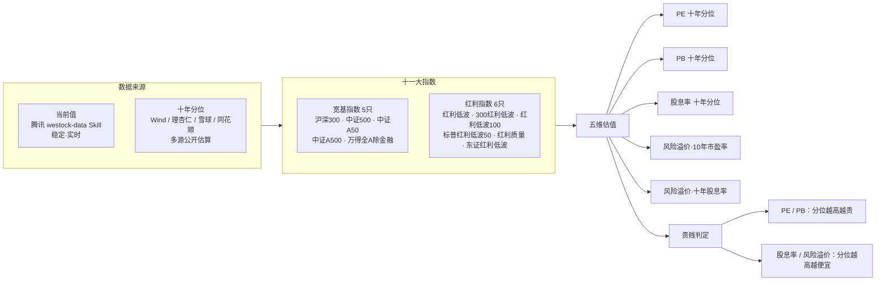

# A股十一大指数 · 十年估值分位汇总

> 一份单页 HTML 报告 + 配套数据说明，汇总 **11 只 A 股核心指数**（宽基 5 只 + 红利 6 只）的十年估值分位，并以「贵 / 一般 / 便宜」统一标注，便于一眼判断当前估值水位。

## 示意图



## 指数清单

**宽基指数（5 只）**

| 指数 | 市值层级 | 编制说明 |
|---|---|---|
| 沪深300 | 大盘 | 沪深两市市值大、流动性最好的前 300 只龙头，覆盖约 A 股 60% 总市值 |
| 中证500 | 中盘 | 剔除沪深300后，按总市值排名 301–800 的中盘股（平均市值约 200–330 亿） |
| 中证A50 | 大盘 | 各一级行业市值最大的 50 只龙头（"核心资产"），2024-01-02 发布 |
| 中证A500 | 大盘（宽基） | 跨行业大盘宽基，约 77% 权重来自沪深300、18% 来自中证500，市值中位约 500 亿 |
| 万得全A（除金融） | 全市场 | 覆盖全部 A 股、剔除金融板块（银行/券商/保险等）后的全市场表征指数 |

**红利指数（6 只，按表内自上而下顺序）**

| 顺序 | 指数 |
|---|---|
| 1 | 红利低波 |
| 2 | 300红利低波 |
| 3 | 红利低波100 |
| 4 | 标普中国A股大盘红利低波50 |
| 5 | 红利质量 |
| 6 | 东证红利低波 |

## 估值维度与贵贱规则

五个分位列统一按阈值着色：
- `<30%` 偏低（绿） · `30%~80%` 中性（琥珀） · `>80%` 偏高（红）

贵贱判定（与"PE/PB 越高越贵、股息率/风险溢价 越高越便宜"一致）：
- **PE / PB 分位**：越高 → 越贵
- **股息率 / 风险溢价 分位**：越高 → 越便宜（越值得买）

## 数据来源与口径

- **当前值（稳定）**：腾讯 `westock-data` Skill（`qt.gtimg.cn`），与公开行情表「A股行情指标」(2026-08-06) 逐项对齐。
- **分位（区间参考）**：Wind / 理杏仁 / 雪球 / 同花顺 经媒体披露的公开数据，多源交叉验证；口径、日期不同，**非稳定通道**，仅供区间参考。
- 风险溢价（10年市盈率）≈ `100% − PE十年分位`（盈利收益率 `1/PE − 10Y国债` 的十年分位，国债扰动小，按 PE 分位反推估算）。
- 风险溢价（十年股息率）= `股息率 − 10Y国债（≈1.73%）` 的十年分位。

## 重要局限

- 付费连接器（Wind / 东方财富妙想 / 同花顺 iFinD）全部 disconnected 且无账号，无法获取权威十年序列。
- "十年分位"边界：中证A50（2024-01）、东证红利低波（2020-04）、300红利低波（2018-12）等上市不足十年，已按可获取的最长区间标注。
- 万得全A（除金融）免费源仅披露"万得全A"，以全A代理；标普红利低波50 部分分位为估算 / 近三年口径；红利质量(931468) 仅获近五年分位，十年分位以近五年极值近似。
- 数据**不构成投资建议**，估值分位随行情每日变动。

## 数据与展示分离（JSON 驱动）

报告采用**数据与展示分离**架构：估值数据全部抽离到 `data.json`，页面加载时由 JavaScript 读取并渲染表格。更新数据**只需替换 `data.json`，HTML 不动**，零改错风险；同一份 JSON 也可喂给未来的 Excel 导出 / API 等。

**`data.json` 结构**

```json
{
  "updated": "2026-08-07",
  "groups": [
    {
      "key": "broad",            // broad=宽基, dividend=红利（对应 tbody 容器 id）
      "title": "宽基指数",
      "rows": [
        {
          "name": "沪深300",
          "code": "H00300 · 000300",
          "cap": "大盘",          // 市值标签，留空则不加标签
          "capClass": "cap-lg",   // cap-lg / cap-mid / cap-all
          "cells": {
            "pe":  {"v":"85.69%","lv":"high","est":false,"note":""},
            "pb":  {"v":"41.96%","lv":"mid", "est":false,"note":""},
            "div": {"v":"78.82%","lv":"mid", "est":false,"note":""},
            "rp1": {"v":"≈14%",  "lv":"low", "est":true, "note":"盈利收益率口径估算"},
            "rp2": {"v":"52.94%","lv":"mid", "est":false,"note":""}
          }
        }
      ]
    }
  ]
}
```

- 每个分位字段：`v`=显示值，`lv`=等级（`high`/`mid`/`low`/`na`，自动映射颜色与「偏高/中性/偏低」文字），`est`=是否估算值（斜体），`note`=口径备注小字。
- 贵贱文字标签由前端按「PE/PB 越高越贵、股息率/风险溢价 越高越便宜」规则自动生成，规则只写在 `index` 脚本里，改规则无需动数据。

## 文件结构

```
.
├── 八大指数十年估值分位汇总.html   # 主报告（单页、响应式、可打印，JS 读取下方 JSON 渲染）
├── data.json                      # 估值数据（唯一数据源，更新只改这里）
├── 八大指数十年估值分位汇总.md     # 数据明细与结论文本版
├── README.md                      # 本说明
└── .gitignore                     # 排除 .workbuddy 等内部数据
```

## 本地查看

- **直接看（推荐，零配置）**：用 WorkBuddy 预览打开，或直接双击 `八大指数十年估值分位汇总.html` 即可看到数据。页面内置一份兜底数据，当 `fetch('./data.json')` 因跨域/路径失败（如 `file://` 或预览隔离路由）时自动启用，保证任何打开方式都能渲染。
- **改数据实时生效**：若希望编辑 `data.json` 后页面立即反映（而非用内嵌兜底），需经 HTTP 访问——在目录下起本地服务器：`python -m http.server 8000`，浏览器访问 `http://localhost:8000/八大指数十年估值分位汇总.html`。

> 数据权威源是 `data.json`；内嵌兜底仅用于离线/隔离场景，更新请改 `data.json` 并重新生成内嵌块（或经 HTTP 访问）。

页面为响应式，手机端自动转为卡片堆叠布局、无横向滚动。

## 更新记录

- 2026-08-07：初版 8 大指数十年估值分位（宽基 4 + 红利 4）。
- 2026-08-08：扩充至 11 大指数（新增万得全A除金融、标普红利低波50、红利质量）；统一贵贱标注；补充宽基指数编制组成小字说明；本 README 与示意图。
- 2026-08-08：重构为**数据与展示分离**——估值数据抽离到 `data.json`，HTML 由 JS 渲染；更新数据仅需替换 JSON，HTML 不动。
