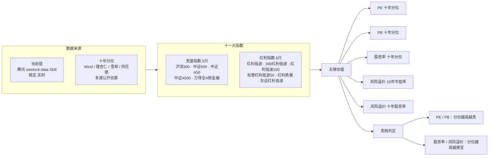

# A股十一大指数 · 十年估值分位汇总

> 一份单页 HTML 报告 + 配套数据说明，汇总 **11 只 A 股核心指数**（宽基 5 只 + 红利 6 只）的十年估值分位，并以「贵 / 一般 / 便宜」统一标注，便于一眼判断当前估值水位。

## 示意图



## 指数清单

**宽基指数（5 只）**

| 指数 | 市值层级 | 编制说明 |
|---|---|---|
| 沪深300 | 大盘 | 沪深两市市值大、流动性最好的前 300 只龙头，覆盖约 A 股 60% 总市值 |
| 中证500 | 中盘 | 剔除沪深300后，按总市值排名 301–800 的中盘股（平均市值约 200–330 亿） |
| 中证A50 | 大盘 | 各一级行业市值最大的 50 只龙头（"核心资产"），2024-01-02 发布 |
| 中证A500 | 大盘（宽基） | 跨行业大盘宽基，约 77% 权重来自沪深300、18% 来自中证500，市值中位约 500 亿 |
| 万得全A（除金融） | 全市场 | 覆盖全部 A 股、剔除金融板块（银行/券商/保险等）后的全市场表征指数 |

**红利指数（6 只，按表内自上而下顺序）**

| 顺序 | 指数 |
|---|---|
| 1 | 红利低波 |
| 2 | 300红利低波 |
| 3 | 红利低波100 |
| 4 | 标普中国A股大盘红利低波50 |
| 5 | 红利质量 |
| 6 | 东证红利低波 |

## 估值维度与贵贱规则

五个分位列统一按阈值着色：
- `<30%` 偏低（绿） · `30%~80%` 中性（琥珀） · `>80%` 偏高（红）

贵贱判定（与"PE/PB 越高越贵、股息率/风险溢价 越高越便宜"一致）：
- **PE / PB 分位**：越高 → 越贵
- **股息率 / 风险溢价 分位**：越高 → 越便宜（越值得买）

## 数据来源与口径

- **当前值（稳定）**：腾讯 `westock-data` Skill（`qt.gtimg.cn`），与公开行情表「A股行情指标」(2026-08-06) 逐项对齐。
- **分位（区间参考）**：Wind / 理杏仁 / 雪球 / 同花顺 经媒体披露的公开数据，多源交叉验证；口径、日期不同，**非稳定通道**，仅供区间参考。
- 风险溢价（10年市盈率）≈ `100% − PE十年分位`（盈利收益率 `1/PE − 10Y国债` 的十年分位，国债扰动小，按 PE 分位反推估算）。
- 风险溢价（十年股息率）= `股息率 − 10Y国债（≈1.73%）` 的十年分位。

## 重要局限

- 付费连接器（Wind / 东方财富妙想 / 同花顺 iFinD）全部 disconnected 且无账号，无法获取权威十年序列。
- "十年分位"边界：中证A50（2024-01）、东证红利低波（2020-04）、300红利低波（2018-12）等上市不足十年，已按可获取的最长区间标注。
- 万得全A（除金融）免费源仅披露"万得全A"，以全A代理；标普红利低波50 部分分位为估算 / 近三年口径；红利质量(931468) 仅获近五年分位，十年分位以近五年极值近似。
- 数据**不构成投资建议**，估值分位随行情每日变动。

## 数据与展示分离（JSON 驱动）

报告采用**数据与展示分离**架构：估值数据全部抽离到 `data.json`，页面加载时由 JavaScript 读取并渲染表格。更新数据**只需替换 `data.json`，HTML 不动**，零改错风险；同一份 JSON 也可喂给未来的 Excel 导出 / API 等。

**`data.json` 结构**

```json
{
  "updated": "2026-08-07",
  "groups": [
    {
      "key": "broad",            // broad=宽基, dividend=红利（对应 tbody 容器 id）
      "title": "宽基指数",
      "rows": [
        {
          "name": "沪深300",
          "code": "H00300 · 000300",
          "cap": "大盘",          // 市值标签，留空则不加标签
          "capClass": "cap-lg",   // cap-lg / cap-mid / cap-all
          "close": 4706.73,       // 当前收盘价（最新收盘点/价；万得全A除金融为 null）
          "ath": 5079.73,         // 近十年最高收盘价（日 K 线 MAX(high)）
          "athDate": "2021-12-13",// 近十年最高出现的日期（YYYY-MM-DD）
          "cells": {
            "pe":  {"v":"85.69%","lv":"high","est":false,"prevPct":79.2,"note":""},
            "pb":  {"v":"41.96%","lv":"mid", "est":false,"prevPct":40.1,"note":""},
            "div": {"v":"78.82%","lv":"mid", "est":false,"prevPct":80.0,"note":""},
            "rp1": {"v":"≈14%",  "lv":"low", "est":true, "prevPct":13.0,"note":"盈利收益率口径估算"},
            "rp2": {"v":"52.94%","lv":"mid", "est":false,"prevPct":48.0,"note":""}
          }
        }
      ]
    }
  ]
}
```

- 每个分位字段：`v`=显示值，`lv`=等级（`high`/`mid`/`low`/`na`，自动映射颜色与「偏高/中性/偏低」文字），`est`=是否估算值（斜体），`prevPct`=上期分位数值（用于增量高亮），`note`=口径备注小字。
- 贵贱文字标签由前端按「PE/PB 越高越贵、股息率/风险溢价 越高越便宜」规则自动生成，规则只写在 `index` 脚本里，改规则无需动数据。

## 增量更新标记（变化高亮）

每个分位字段可带 `prevPct`（上一期分位数值）。页面渲染时计算 `差值 = 当前值 − prevPct`：

- **|差值| > 5pp**：该单元格显示 `▲/▼ N.Npp` 徽标（▲红=分位上升=更贵，▼绿=分位下降=更便宜，沿用 A 股涨红跌绿约定），并触发一次**脉冲高亮动画**，一眼识别"哪些指数估值发生了显著变化"。
- **|差值| ≤ 5pp** 或 **无 `prevPct`**：不标记（视为无显著变化）。

阈值 `DELTA_THRESHOLD = 5`（百分点，脚本顶部可配）。`na`（无数据）单元格不计算差值。

**更新 `prevPct` 的工作流**：每次把 `data.json` 更新到新一期时，先把各单元格当前 `v` 的数值拷进 `prevPct`，再把 `v` 覆盖为新值；这样下一期查看时，`prevPct` 即"上一期"，差值自动反映本期变化。当前仓库内的 `prevPct` 为示例参考值（非真实历史快照）。

## 数据时效自动检测

`data.json` 的 `dataDate` 字段记录数据日期，页面顶部自动渲染**时效指示器**：按 `new Date() − dataDate` 的天数差分级——

- **< 7 天**：绿色「新鲜」
- **7–30 天**：黄色「注意 · 稍旧」
- **> 30 天**：红色「已过期」

阈值 `FRESH=7` / `MAXAGE=30` 在脚本顶部可配置（data.json 与内嵌兜底均需含 `dataDate`）。用户打开页面第一眼即可判断数据是否可靠。

## 指数横向对比 · 雷达图

页面底部新增一张**纯 SVG 雷达图**（零依赖、离线可用，不引入任何 CDN/外部库），横向对比 6 个核心指数在 4 个估值维度上的十年分位：

- **6 条折线（不同颜色）**：沪深300、中证500、中证A500、万得全A（除金融）、红利低波、红利质量。
- **4 个维度轴**：PE 分位、PB 分位、股息率 分位、风险溢价（十年股息率）分位。
- **读法（重要）**：外圈 = 分位更高；**PE / PB 轴越往外越贵**，**股息率 / 风险溢价轴越往外越便宜**。因此"形状偏向 PE/PB 轴"的指数当前偏贵，"形状偏向股息率/风险溢价轴"的指数相对便宜——一眼看出哪个指数在哪个维度上最便宜/最贵。
- **图例可点击筛选**：点击右侧图例项可显隐对应指数，便于两两对比。
- 数据同样来自 `data.json`（取各指数 `pe/pb/div/rp2` 的 `v`），更新数据后雷达图自动重绘；若某指数某维度为 `na`，该维度按 0 处理。

> 注：原计划用 Chart.js（CDN ~60KB），但本报告的打开场景含「预览 / `file://` / 离线」，CDN 会加载失败导致图表空白，故改用内联 SVG——体积更小、离线可用、且同样满足"多折线+可点击图例"的需求。如需切换为 Chart.js 版本，可改由本地 vendored 文件引入（避免 CDN 依赖）。

## 估值分位迷你走势（sparkline）

每个指数名称右侧嵌入一条 **PE 分位近期走势迷你折线图**（内联 SVG `<polyline>`，30×80 量级、零依赖）：

- 数据来自 `data.json` 每行新增的 `history` 字段（一组 PE 十年分位历史数值，最后一点=当期值）。
- 折线颜色按趋势：**上升（分位走高=变贵）→ 红**，**下降（分位走低=变便宜）→ 绿**，末尾用圆点标出最新值；鼠标悬停（aria-label）可见具体序列。
- 收益：能区分"一路阴跌到 8%"还是"突然暴跌到 8%"，对估值质量的判断完全不同。
- 维护：更新 `data.json` 时在每行加/维护 `history` 数组即可；缺字段（无 history 或 <2 点）时自动不显示，不影响表格。

> 注：当前仓库内 `history` 为**示例走势数据**（非真实历史快照），仅用于演示走势图形态；正式使用需按各指数真实 PE 分位序列维护。

## 当前收盘价 & 距历史最高回撤（价格维度）

在「指数（价格指数）」列之后、PE/PB 分位列之前，新增两列**价格维度**，补充分位之外的"价格位置"视角：

- **当前收盘价**：取自 2026-08-07 各指数（或代理 ETF）最新收盘点/价，千分位格式化。
- **距历史最高回撤**：`dd = (当前收盘价 − 近十年最高收盘价) ÷ 近十年最高收盘价 × 100%`，近十年最高取自 `westock-data` 日 K 线（2016-01-01 至今）的 `MAX(high)`。单元格大字显示回撤幅度（如 `-7.3%`），小字 `.dd-meta` 标注「最高 XXXX.XX（YYYY-MM）」。
- **5 档颜色分档**（回撤越深、离历史峰值越远 = 越绿 = 越有安全垫 / 相对越便宜）：
  - `0% ~ -10%` → 红 `.cell-dd-shallow`
  - `-10% ~ -20%` → 黄 `.cell-dd-mild`
  - `-20% ~ -30%` → 浅绿 `.cell-dd-moderate`
  - `-30% ~ -40%` → 绿 `.cell-dd-deep`
  - `< -40%` → 深绿 `.cell-dd-extreme`
- **数据缺口处理**：万得全A（除金融）免费源无独立代码，两列均标「无数据源」；标普红利低波50 以跟踪 ETF（515450）价格代理。

数据取自 `data.json` 每行的 `close` / `ath` / `athDate` 字段；回撤由前端按上述公式**实时计算**（不直接存回撤值，避免口径漂移）。`data.json` 与内嵌兜底均需含这三个字段，更新指数价格时维护即可。

## 文件结构

```
.
├── 八大指数十年估值分位汇总.html   # 主报告（单页、响应式、可打印，JS 读取下方 JSON 渲染）
├── data.json                      # 估值数据（唯一数据源，更新只改这里）
├── 八大指数十年估值分位汇总.md     # 数据明细与结论文本版
├── README.md                      # 本说明
└── .gitignore                     # 排除 .workbuddy 等内部数据
```

## 本地查看

- **直接看（推荐，零配置）**：用 WorkBuddy 预览打开，或直接双击 `八大指数十年估值分位汇总.html` 即可看到数据。页面内置一份兜底数据，当 `fetch('./data.json')` 因跨域/路径失败（如 `file://` 或预览隔离路由）时自动启用，保证任何打开方式都能渲染。
- **改数据实时生效**：若希望编辑 `data.json` 后页面立即反映（而非用内嵌兜底），需经 HTTP 访问——在目录下起本地服务器：`python -m http.server 8000`，浏览器访问 `http://localhost:8000/八大指数十年估值分位汇总.html`。

> 数据权威源是 `data.json`；内嵌兜底仅用于离线/隔离场景，更新请改 `data.json` 并重新生成内嵌块（或经 HTTP 访问）。

页面为响应式，手机端自动转为卡片堆叠布局、无横向滚动。

## 更新记录

- 2026-08-07：初版 8 大指数十年估值分位（宽基 4 + 红利 4）。
- 2026-08-08：扩充至 11 大指数（新增万得全A除金融、标普红利低波50、红利质量）；统一贵贱标注；补充宽基指数编制组成小字说明；本 README 与示意图。
- 2026-08-08：重构为**数据与展示分离**——估值数据抽离到 `data.json`，HTML 由 JS 渲染；更新数据仅需替换 JSON，HTML 不动。
- 2026-08-08：新增**增量更新标记**——`data.json` 各单元格加 `prevPct`（上期值），渲染时按 |当前−上期| > 5pp 高亮 `▲/▼ N.Npp` 徽标并脉冲动画，一眼识别显著变化指数。
- 2026-08-08：新增**指数横向对比雷达图**——页面底部内联 SVG 雷达图（零依赖、离线可用），6 核心指数 × 4 维度（PE/PB/股息率/风险溢价 分位）对比，图例可点击显隐；数据取自 `data.json`。原方案 Chart.js CDN 因离线场景会空白，改为 SVG。
- 2026-08-08：新增**估值分位迷你走势（sparkline）**——每指数名右侧内联 SVG 折线（PE 分位 history 序列），上升=红(变贵)/下降=绿(变便宜)；`data.json` 各 row 新增 `history` 数组，内嵌兜底同步更新。当前 history 为示例数据。
- 2026-08-08：新增**当前收盘价 & 距历史最高回撤两列**——插入在「指数」列之后、PE/PB 分位列之前；回撤 = (当前收盘价 − 近十年最高) ÷ 近十年最高，近十年最高取自 `westock-data` 日 K 线 `MAX(high)`（2016-01-01 至今），5 档颜色分档（红→深绿），移动端经 `data-label` 自动转卡片标签；`data.json` 各 row 写入 `close/ath/athDate`，内嵌兜底同步。万得全A（除金融）无数据源标「无数据源」。
